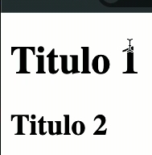
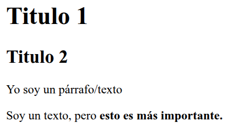

# FUNDAMENTOS DE HTML

## Jerarquia de textos
La jerarquia de textos se refiere a que algunos textos se les da más importancia (a nivel de lectura) que a otros.

Veamos un ejemplo.
Algo que nos ayuda a representar esta idea, de manera sencilla son los titulos en HTML (`<h1>` - `<h6>`).

```HTML
<body>
    <!-- Estos son titulos -->
    <h1>Titulo 1</h1>
    <h2>Titulo 2</h2>
</body>
```


Aquí podemos ver que al "Titulo 1" se le da una mayor tamaño de texto que al "Titulo 2". Y esto quiere decir que el "Titulo 1" es mucho más importante que el "Titulo 2" (a nivel de lectura).

###### **Reglas**
- **No debemos tener más de UN `<h1>` POR ARCHIVO HTML**, ya que esto le dira al navegador cuál es el código más importante.

Con los titulos de `<h2>` en adelante, si ya podemos tener más de uno dentro de nuestro archivo, **y esto no se consideraría como una mala práctica**.

### Resaltado

Ahora existen ocasiones en las que necesitamos resaltar partes especificas de un texto (ya que estás pueden ser más importantes), ya para eso hacemo uso de la etiqueta `<strong>`.

```HTML 
<!-- Reslatar un texto -->
<p>Soy un texto, pero <strong>esto es más importante.</strong></p>
```


> NOTA: Esto no quiere decir que SEMANTICAMENTE esa parte sea más importante que el resto del texto, solo estamos resaltando una parte del texto.

### Citas

Para las ocasiones que dentro de nuestar página web necesitemos citar las palabras de alguna persona, esto lo podemos realizar con la etiqueta de `<blockquote>`, y con ella podemos agregar citas dentro de nuestro archivo HTML.

```HTML
<!-- Para agregar citas en nuestra página -->
<blockquote>"Para citar"</blockquote>
```

En este sitío web podemos encontrar eitquetas que nos ayuden a enterder la semantica de HTML [Referencia de Elementos HTML](https://developer.mozilla.org/es/docs/Web/HTML/Reference/Elements#contenido_del_texto).
